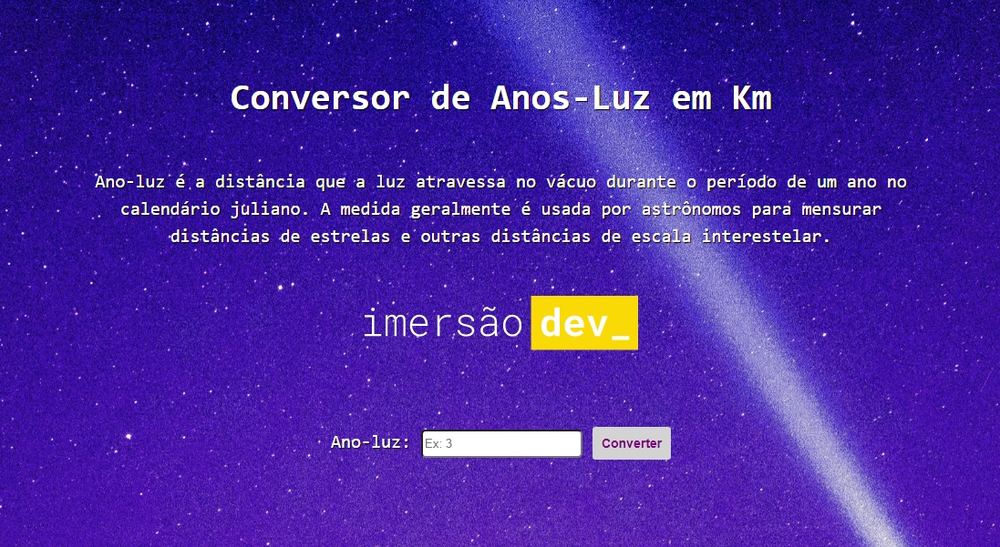

<h1 align="center">
    
</h1>

  :white_check_mark: <a href="https://andreadcsousa.github.io/alura_imersao_dia1/" target="_blank">Veja a página</a>&nbsp;&nbsp;&nbsp;|&nbsp;&nbsp;&nbsp;
  :white_check_mark: <a href="https://codepen.io/imersao-dev" target="_blank">Conheça os projetos</a>

# :computer: Projeto
 
- Idealizador: Alura
- Projeto: Imersão Dev Alura
- Lado da força: Front-End
- Tipo: Projeto com 'live coding'
- Etapa: Conversor de distância

# :rocket: Tecnologias

Esse projeto foi desenvolvido com:

# :art: Layout

